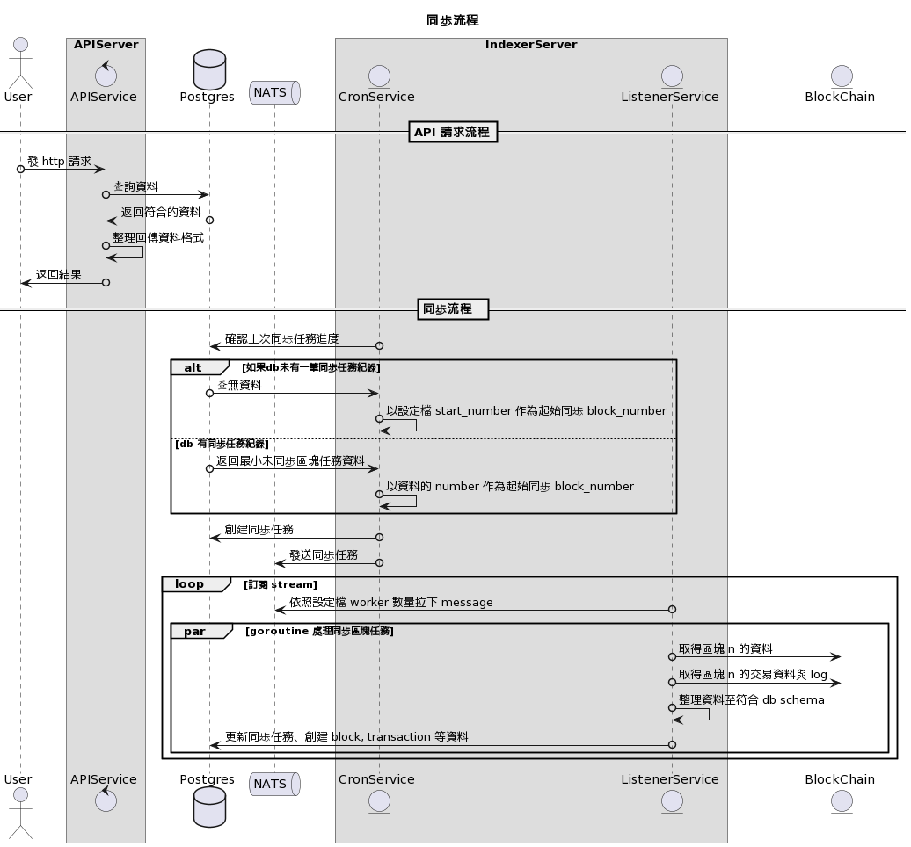

# blockhw


## Quick Start

### Prerequisites
- [Go](https://golang.org/doc/install) 1.21.3 or higher
- [Docker](https://docs.docker.com/install/) 20.10.6 or higher
- [Docker Compose](https://docs.docker.com/compose/install/) 1.29 or higher
- [Make](https://www.gnu.org/software/make/) 3.81 or higher

### Scripts
```bash
# start server
$ make up-local
# stop server
$ make down-local
```

## Introduction

### Architecture


- User: api 使用者
- APIService: api 服務
- Postgres: 資料庫
- Nats: 訊息佇列
- CronService: 定時任務，負責發送同步任務給 ListenerService
- ListenerService: 監聽 Nats 訊息佇列，並執行同步任務
- BlockChain: 區塊鏈節點

### Project Structure
- cmd: main package，負責啟動 server
- config: config yaml
- docker: dockerfile
- docs: documents
- internal: internal package
  - app: app package，負責啟動 server 內的多個服務
  - appcontext: app context package
  - binder: binder package
  - config: config package
  - controller: controller package
  - cron: cron package
  - listener: listener package
  - logging: logging package
  - models: model package
  - repository: repository package
  - usecase: usecase package
  - utils: utils package
  - wrapper: wrapper package